# HOME CREDIT INDONESIA SCORECARD MODEL
## Problem Statement:

Home Credit saat ini sedang menggunakan berbagai macam metode statistik dan Machine Learning untuk membuat prediksi skor kredit. Sekarang, kami meminta anda untuk membuka potensi maksimal dari data kami. **Dengan melakukannya, kita dapat memastikan pelanggan yang mampu melakukan pelunasan tidak ditolak ketika melakukan pengajuan pinjaman, dan pinjaman datap diberikan dengan principal, maturity, dan repayment calendar yang akan memotivsi pelanggan untuk sukses.** Evaluasi akan dilakukan dengan mengecek seberapa dalam pemahaman analisa yang anda kerjakan. Sebagai catatan, anda perlu menggunakan **setidaknya 2 model Machine Learning dimana salah satunya adalah Logistic Regression**. Setelah itu, buatlah slide presentasi yang mengandung analisa hasil pemodelan secara end-to-end beserta rekomendasi bisnisnya (maksimal 10 halaman)

Point:
1. Predict probability variable TARGET
2. Pakai 2 model, salah satunya Logistic Regression
3. Cari top 2 insight (relate satu atau lebih variable dengan target atau yang lainnya) dan solusi
4. 

## Import Library dan Load Data
Pada tahap ini akan diimpport beberapa library Python yang diperlukan serta melakukan pembacaan data.


```python
# %config IPCompleter.greedy=True
```


```python
import os
import sys

import numpy as np
import pandas as pd

import matplotlib.pylab as plt
from matplotlib_venn import venn2
import seaborn as sns

from sklearn import metrics
from sklearn import model_selection
from sklearn import preprocessing
from sklearn import linear_model
from sklearn import feature_selection

# Suppress warnings 
import warnings
warnings.filterwarnings('ignore')
```

Terdapat 9 data yang diberikan dengan data utama berupa data training dan data testing. Sementara ini, analisis kali ini hanya akan menggunakan kedua data tersebut untuk membentuk model baseline yang dapat dikembangkan lebih jauh selanjutnya. Berikut adalah ukuran data training dan data testing.


```python
%%time
train_df = pd.read_csv('application_train.csv')
test_df = pd.read_csv('application_test.csv')

train_df.shape, test_df.shape
```

    CPU times: total: 4.98 s
    Wall time: 5.34 s
    


    ((307511, 122), (48744, 121))


Data training berjumlah 307511 dengan jumlah features sebanyak 122 sementara data test berjumlah 48733 dengan 121 fitur (tidak ada TARGET pada data test).


## Exploratory Data Analysis

### Target Distribution:
Hal pertama yang perlu dilihat adalah distribusi dari kolom target dimana:
* TARGET 0 -> Pinjaman dibayar tepat waktu
* TARGET 1 -> Menandakan bahwa client mengalami kesulitan untuk membayar


```python
fig, ax = plt.subplots(figsize=(10,5))
sns.countplot(x=train_df['TARGET'])
plt.show()
```


    
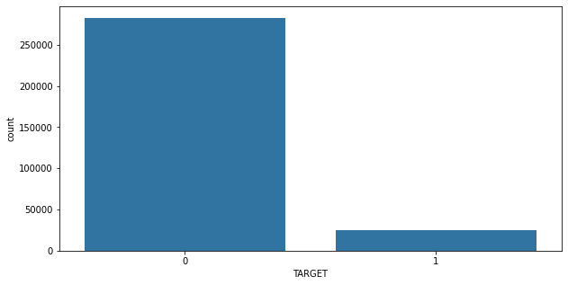
    


Data tidak seimbang, lebih banyak TARGET 0 dibanding 1

Selanjutnya, kita lihat apakah data training dan test yang diberikan memiliki observasi yang overlap (terdapat data yang berada di kedua dataset sekaligus) atau tidak


```python
fig, ax = plt.subplots(figsize=(10,5))
set1 = set(train_df.SK_ID_CURR.unique())
set2 = set(test_df.SK_ID_CURR.unique())

venn2([set1, set2], ('train', 'test'))
plt.show()
```


    
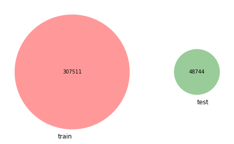
    


Terlihat pada gambar di atas bahwa tidak ada data yang overlap

## Menangani Missing Values

Selanjutnya adalah terkait penanganan missing values. Berikut tampilan beberapa data pertama dari dataset training dan dataset testing.


```python
# Training dataset
print('Training data shape: ', train_df.shape)
train_df.head()
```

    Training data shape:  (307511, 122)
    


<div>
<style scoped>
    .dataframe tbody tr th:only-of-type {
        vertical-align: middle;
    }

    .dataframe tbody tr th {
        vertical-align: top;
    }

    .dataframe thead th {
        text-align: right;
    }
</style>
<table border="1" class="dataframe">
  <thead>
    <tr style="text-align: right;">
      <th></th>
      <th>SK_ID_CURR</th>
      <th>TARGET</th>
      <th>NAME_CONTRACT_TYPE</th>
      <th>CODE_GENDER</th>
      <th>FLAG_OWN_CAR</th>
      <th>FLAG_OWN_REALTY</th>
      <th>CNT_CHILDREN</th>
      <th>AMT_INCOME_TOTAL</th>
      <th>AMT_CREDIT</th>
      <th>AMT_ANNUITY</th>
      <th>...</th>
      <th>FLAG_DOCUMENT_18</th>
      <th>FLAG_DOCUMENT_19</th>
      <th>FLAG_DOCUMENT_20</th>
      <th>FLAG_DOCUMENT_21</th>
      <th>AMT_REQ_CREDIT_BUREAU_HOUR</th>
      <th>AMT_REQ_CREDIT_BUREAU_DAY</th>
      <th>AMT_REQ_CREDIT_BUREAU_WEEK</th>
      <th>AMT_REQ_CREDIT_BUREAU_MON</th>
      <th>AMT_REQ_CREDIT_BUREAU_QRT</th>
      <th>AMT_REQ_CREDIT_BUREAU_YEAR</th>
    </tr>
  </thead>
  <tbody>
    <tr>
      <th>0</th>
      <td>100002</td>
      <td>1</td>
      <td>Cash loans</td>
      <td>M</td>
      <td>N</td>
      <td>Y</td>
      <td>0</td>
      <td>202500.0</td>
      <td>406597.5</td>
      <td>24700.5</td>
      <td>...</td>
      <td>0</td>
      <td>0</td>
      <td>0</td>
      <td>0</td>
      <td>0.0</td>
      <td>0.0</td>
      <td>0.0</td>
      <td>0.0</td>
      <td>0.0</td>
      <td>1.0</td>
    </tr>
    <tr>
      <th>1</th>
      <td>100003</td>
      <td>0</td>
      <td>Cash loans</td>
      <td>F</td>
      <td>N</td>
      <td>N</td>
      <td>0</td>
      <td>270000.0</td>
      <td>1293502.5</td>
      <td>35698.5</td>
      <td>...</td>
      <td>0</td>
      <td>0</td>
      <td>0</td>
      <td>0</td>
      <td>0.0</td>
      <td>0.0</td>
      <td>0.0</td>
      <td>0.0</td>
      <td>0.0</td>
      <td>0.0</td>
    </tr>
    <tr>
      <th>2</th>
      <td>100004</td>
      <td>0</td>
      <td>Revolving loans</td>
      <td>M</td>
      <td>Y</td>
      <td>Y</td>
      <td>0</td>
      <td>67500.0</td>
      <td>135000.0</td>
      <td>6750.0</td>
      <td>...</td>
      <td>0</td>
      <td>0</td>
      <td>0</td>
      <td>0</td>
      <td>0.0</td>
      <td>0.0</td>
      <td>0.0</td>
      <td>0.0</td>
      <td>0.0</td>
      <td>0.0</td>
    </tr>
    <tr>
      <th>3</th>
      <td>100006</td>
      <td>0</td>
      <td>Cash loans</td>
      <td>F</td>
      <td>N</td>
      <td>Y</td>
      <td>0</td>
      <td>135000.0</td>
      <td>312682.5</td>
      <td>29686.5</td>
      <td>...</td>
      <td>0</td>
      <td>0</td>
      <td>0</td>
      <td>0</td>
      <td>NaN</td>
      <td>NaN</td>
      <td>NaN</td>
      <td>NaN</td>
      <td>NaN</td>
      <td>NaN</td>
    </tr>
    <tr>
      <th>4</th>
      <td>100007</td>
      <td>0</td>
      <td>Cash loans</td>
      <td>M</td>
      <td>N</td>
      <td>Y</td>
      <td>0</td>
      <td>121500.0</td>
      <td>513000.0</td>
      <td>21865.5</td>
      <td>...</td>
      <td>0</td>
      <td>0</td>
      <td>0</td>
      <td>0</td>
      <td>0.0</td>
      <td>0.0</td>
      <td>0.0</td>
      <td>0.0</td>
      <td>0.0</td>
      <td>0.0</td>
    </tr>
  </tbody>
</table>
<p>5 rows × 122 columns</p>
</div>


```python
# Testing dataset
print('Testing data shape: ', test_df.shape)
test_df.head()
```

    Testing data shape:  (48744, 121)
    


<div>
<style scoped>
    .dataframe tbody tr th:only-of-type {
        vertical-align: middle;
    }

    .dataframe tbody tr th {
        vertical-align: top;
    }

    .dataframe thead th {
        text-align: right;
    }
</style>
<table border="1" class="dataframe">
  <thead>
    <tr style="text-align: right;">
      <th></th>
      <th>SK_ID_CURR</th>
      <th>NAME_CONTRACT_TYPE</th>
      <th>CODE_GENDER</th>
      <th>FLAG_OWN_CAR</th>
      <th>FLAG_OWN_REALTY</th>
      <th>CNT_CHILDREN</th>
      <th>AMT_INCOME_TOTAL</th>
      <th>AMT_CREDIT</th>
      <th>AMT_ANNUITY</th>
      <th>AMT_GOODS_PRICE</th>
      <th>...</th>
      <th>FLAG_DOCUMENT_18</th>
      <th>FLAG_DOCUMENT_19</th>
      <th>FLAG_DOCUMENT_20</th>
      <th>FLAG_DOCUMENT_21</th>
      <th>AMT_REQ_CREDIT_BUREAU_HOUR</th>
      <th>AMT_REQ_CREDIT_BUREAU_DAY</th>
      <th>AMT_REQ_CREDIT_BUREAU_WEEK</th>
      <th>AMT_REQ_CREDIT_BUREAU_MON</th>
      <th>AMT_REQ_CREDIT_BUREAU_QRT</th>
      <th>AMT_REQ_CREDIT_BUREAU_YEAR</th>
    </tr>
  </thead>
  <tbody>
    <tr>
      <th>0</th>
      <td>100001</td>
      <td>Cash loans</td>
      <td>F</td>
      <td>N</td>
      <td>Y</td>
      <td>0</td>
      <td>135000.0</td>
      <td>568800.0</td>
      <td>20560.5</td>
      <td>450000.0</td>
      <td>...</td>
      <td>0</td>
      <td>0</td>
      <td>0</td>
      <td>0</td>
      <td>0.0</td>
      <td>0.0</td>
      <td>0.0</td>
      <td>0.0</td>
      <td>0.0</td>
      <td>0.0</td>
    </tr>
    <tr>
      <th>1</th>
      <td>100005</td>
      <td>Cash loans</td>
      <td>M</td>
      <td>N</td>
      <td>Y</td>
      <td>0</td>
      <td>99000.0</td>
      <td>222768.0</td>
      <td>17370.0</td>
      <td>180000.0</td>
      <td>...</td>
      <td>0</td>
      <td>0</td>
      <td>0</td>
      <td>0</td>
      <td>0.0</td>
      <td>0.0</td>
      <td>0.0</td>
      <td>0.0</td>
      <td>0.0</td>
      <td>3.0</td>
    </tr>
    <tr>
      <th>2</th>
      <td>100013</td>
      <td>Cash loans</td>
      <td>M</td>
      <td>Y</td>
      <td>Y</td>
      <td>0</td>
      <td>202500.0</td>
      <td>663264.0</td>
      <td>69777.0</td>
      <td>630000.0</td>
      <td>...</td>
      <td>0</td>
      <td>0</td>
      <td>0</td>
      <td>0</td>
      <td>0.0</td>
      <td>0.0</td>
      <td>0.0</td>
      <td>0.0</td>
      <td>1.0</td>
      <td>4.0</td>
    </tr>
    <tr>
      <th>3</th>
      <td>100028</td>
      <td>Cash loans</td>
      <td>F</td>
      <td>N</td>
      <td>Y</td>
      <td>2</td>
      <td>315000.0</td>
      <td>1575000.0</td>
      <td>49018.5</td>
      <td>1575000.0</td>
      <td>...</td>
      <td>0</td>
      <td>0</td>
      <td>0</td>
      <td>0</td>
      <td>0.0</td>
      <td>0.0</td>
      <td>0.0</td>
      <td>0.0</td>
      <td>0.0</td>
      <td>3.0</td>
    </tr>
    <tr>
      <th>4</th>
      <td>100038</td>
      <td>Cash loans</td>
      <td>M</td>
      <td>Y</td>
      <td>N</td>
      <td>1</td>
      <td>180000.0</td>
      <td>625500.0</td>
      <td>32067.0</td>
      <td>625500.0</td>
      <td>...</td>
      <td>0</td>
      <td>0</td>
      <td>0</td>
      <td>0</td>
      <td>NaN</td>
      <td>NaN</td>
      <td>NaN</td>
      <td>NaN</td>
      <td>NaN</td>
      <td>NaN</td>
    </tr>
  </tbody>
</table>
<p>5 rows × 121 columns</p>
</div>


Terlihat bahwa dari kedua dataset, terdapat beberapa kolom yang memiliki missing values. Selanjutnya akan kita lihat berapa jumlah kolom yang memiliki missing values beserta jumlah dan persentase dari missing values tersebut.


```python
# Function to calculate missing values by column
def missing_values_table(df):
        # Total missing values
        mis_val = df.isnull().sum()
        
        # Percentage of missing values
        mis_val_percent = 100 * df.isnull().sum() / len(df)
        
        # Make a table with the results
        mis_val_table = pd.concat([mis_val, mis_val_percent], axis=1)
        
        # Rename the columns
        mis_val_table_ren_columns = mis_val_table.rename(
        columns = {0 : 'Missing Values', 1 : '% of Total'})
        
        # Sort the table by percentage of missing descending
        mis_val_table_ren_columns = mis_val_table_ren_columns[mis_val_table_ren_columns.iloc[:, 1] != 0]
        mis_val_table_ren_columns = mis_val_table_ren_columns.sort_values('% of Total', ascending=False).round(1)
        
        # Print some summary information
        print ("Your selected dataframe has " + str(df.shape[1]) + " columns.\n"      
            "There are " + str(mis_val_table_ren_columns.shape[0]) +
              " columns that have missing values.")
        
        # Return the dataframe with missing information
        return mis_val_table_ren_columns
```


```python
# Missing values statistics
missing_values = missing_values_table(train_df)
missing_values.head(10)
```

    Your selected dataframe has 122 columns.
    There are 67 columns that have missing values.
    


<div>
<style scoped>
    .dataframe tbody tr th:only-of-type {
        vertical-align: middle;
    }

    .dataframe tbody tr th {
        vertical-align: top;
    }

    .dataframe thead th {
        text-align: right;
    }
</style>
<table border="1" class="dataframe">
  <thead>
    <tr style="text-align: right;">
      <th></th>
      <th>Missing Values</th>
      <th>% of Total</th>
    </tr>
  </thead>
  <tbody>
    <tr>
      <th>COMMONAREA_MEDI</th>
      <td>214865</td>
      <td>69.9</td>
    </tr>
    <tr>
      <th>COMMONAREA_AVG</th>
      <td>214865</td>
      <td>69.9</td>
    </tr>
    <tr>
      <th>COMMONAREA_MODE</th>
      <td>214865</td>
      <td>69.9</td>
    </tr>
    <tr>
      <th>NONLIVINGAPARTMENTS_MEDI</th>
      <td>213514</td>
      <td>69.4</td>
    </tr>
    <tr>
      <th>NONLIVINGAPARTMENTS_MODE</th>
      <td>213514</td>
      <td>69.4</td>
    </tr>
    <tr>
      <th>NONLIVINGAPARTMENTS_AVG</th>
      <td>213514</td>
      <td>69.4</td>
    </tr>
    <tr>
      <th>FONDKAPREMONT_MODE</th>
      <td>210295</td>
      <td>68.4</td>
    </tr>
    <tr>
      <th>LIVINGAPARTMENTS_MODE</th>
      <td>210199</td>
      <td>68.4</td>
    </tr>
    <tr>
      <th>LIVINGAPARTMENTS_MEDI</th>
      <td>210199</td>
      <td>68.4</td>
    </tr>
    <tr>
      <th>LIVINGAPARTMENTS_AVG</th>
      <td>210199</td>
      <td>68.4</td>
    </tr>
  </tbody>
</table>
</div>


Terlihat bahwa terdapat 67 kolom pada data training. Keberadaan missing value tersebut akan mempengaruhi model yang akan dibangun nantinya. Terdapat beberapa cara yang dapat digunakan untuk mengataasi hal tersebut seperti mengisi data yang kosong tersebut atau pun menghapus kolom yang memiliki persentasi missing value yang besar. Namun, karena saat ini belum diketahui apakah kolom-kolom tersebut memiliki peran dalam memprediksi target, untuk saat ini data tidak akan diubah terlebih dahulu.

## Tipe Kolom
Berikut adalah tipe kolom pada dataset training


```python
train_df.dtypes.value_counts()
```


    float64    65
    int64      41
    object     16
    Name: count, dtype: int64


```python
train_df.dtypes.head(10)
```


    SK_ID_CURR              int64
    TARGET                  int64
    NAME_CONTRACT_TYPE     object
    CODE_GENDER            object
    FLAG_OWN_CAR           object
    FLAG_OWN_REALTY        object
    CNT_CHILDREN            int64
    AMT_INCOME_TOTAL      float64
    AMT_CREDIT            float64
    AMT_ANNUITY           float64
    dtype: object


Terdapat 65 kolom dengan tipe data `float64` dan 41 kolom dengantipe data `int64` yang keduanya merupakan data numerik. Lalu, terdapat juga 16 kolom dengan tipe `object` yang berisikan string dan merupakan data categorical seperti kode gender/jenis kelamin, nama kontrak, dsb.

Berikut adalah jumlah dari kategori pada masing-masing kolom yang bersifat categorical.


```python
train_df.select_dtypes('object').apply(pd.Series.nunique, axis = 0)
```


    NAME_CONTRACT_TYPE             2
    CODE_GENDER                    3
    FLAG_OWN_CAR                   2
    FLAG_OWN_REALTY                2
    NAME_TYPE_SUITE                7
    NAME_INCOME_TYPE               8
    NAME_EDUCATION_TYPE            5
    NAME_FAMILY_STATUS             6
    NAME_HOUSING_TYPE              6
    OCCUPATION_TYPE               18
    WEEKDAY_APPR_PROCESS_START     7
    ORGANIZATION_TYPE             58
    FONDKAPREMONT_MODE             4
    HOUSETYPE_MODE                 3
    WALLSMATERIAL_MODE             7
    EMERGENCYSTATE_MODE            2
    dtype: int64


```python
train_df.select_dtypes('object').apply(lambda x: x.unique(), axis=0).head(5)
```


    NAME_CONTRACT_TYPE                        [Cash loans, Revolving loans]
    CODE_GENDER                                                 [M, F, XNA]
    FLAG_OWN_CAR                                                     [N, Y]
    FLAG_OWN_REALTY                                                  [Y, N]
    NAME_TYPE_SUITE       [Unaccompanied, Family, Spouse, partner, Child...
    dtype: object


## Encoding
Salah satu model yang diminta untuk dibuat pada problem statement adalah **logistic regression**. Model tersebut tidak bisa menangani variabel yang bersifat categorical. Oleh karena itu, diperlukan proses encoding pada variabel-variabel tersebut sehingga dapat direpresentasikan dengan angka.

Pada proses ini, data kategorikal yang hanya memiliki 2 unique values (atau kurang) akan melalui proses label encoding (menggunakan `LabelEncoder` dari Scikit-learn) sedangkan yang lainnya akan melalui proses one-hot encoding (menggunakan metode `get_dummies(df)` dari pandas).


```python
# instansiasi objek label encoder
lab_en = preprocessing.LabelEncoder()
lab_en_count = 0

for col in train_df:
    if train_df[col].dtype == 'object':
        # If 2 or fewer unique categories
        if len(list(train_df[col].unique())) <= 2:
            # Train on the training data
            lab_en.fit(train_df[col])
            # Transform
            train_df[col] = lab_en.transform(train_df[col])
            test_df[col] = lab_en.transform(test_df[col])
            
            lab_en_count += 1
            
print('%d columns were label encoded.' % lab_en_count)
```

    3 columns were label encoded.
    


```python
# one-hot encoding pada kolom categorical lainnya
train_df = pd.get_dummies(train_df)
test_df = pd.get_dummies(test_df)

print('Training shape: ', train_df.shape)
print('Testing shape: ', test_df.shape)
```

    Training shape:  (307511, 243)
    Testing shape:  (48744, 239)
    

Terlihat bahwa pada setelah proses di atas, ukuran data training dan data testing berubah. Hal tersebut diakibatkan oleh proses one-hot encoding yang menghasilkan kolom-kolom baru. Terdapat ketidaksesuaian antara kolom yang dihasilkan pada data training dan data testing dimana seharusnya data training hanya memiliki tambahan satu kolom saja (kolom TARGET). Perlu dilakukan alignment antara data testing dan data training.


```python
# Simpan kolom TARGET dari data training terlebih dahulu
train_labels = train_df['TARGET']

# Align the training and testing data, keep only columns present in both dataframes
train_df, test_df = train_df.align(test_df, join = 'inner', axis = 1)
print('Training shape before: ', train_df.shape)
print('Testing shape before: ', test_df.shape)

# Kembalikan kolom target pada data training
train_df['TARGET'] = train_labels

print('Training shape after: ', train_df.shape)
print('Testing shape after: ', test_df.shape)
```

    Training shape before:  (307511, 239)
    Testing shape before:  (48744, 239)
    Training shape after:  (307511, 240)
    Testing shape after:  (48744, 239)
    

## Outlier
Pertama, kita lihat nilai variance dari masing-masing kolom


```python
from tqdm import tqdm # feedback
```


```python
train_df.var().sort_values().tail(20)
```


    REGION_RATING_CLIENT          2.591155e-01
    CNT_CHILDREN                  5.214593e-01
    AMT_REQ_CREDIT_BUREAU_QRT     6.305244e-01
    CNT_FAM_MEMBERS               8.293409e-01
    AMT_REQ_CREDIT_BUREAU_MON     8.390604e-01
    AMT_REQ_CREDIT_BUREAU_YEAR    3.494264e+00
    OBS_60_CNT_SOCIAL_CIRCLE      5.663464e+00
    OBS_30_CNT_SOCIAL_CIRCLE      5.764747e+00
    HOUR_APPR_PROCESS_START       1.066566e+01
    OWN_CAR_AGE                   1.426785e+02
    DAYS_LAST_PHONE_CHANGE        6.836123e+05
    DAYS_ID_PUBLISH               2.278441e+06
    DAYS_REGISTRATION             1.241073e+07
    DAYS_BIRTH                    1.904440e+07
    AMT_ANNUITY                   2.100684e+08
    SK_ID_CURR                    1.056582e+10
    DAYS_EMPLOYED                 1.995884e+10
    AMT_INCOME_TOTAL              5.622739e+10
    AMT_GOODS_PRICE               1.364907e+11
    AMT_CREDIT                    1.619988e+11
    dtype: float64


Terlihat bahwa terdapat beberapa kolom dengan nilai variance yang sangat tinggi. 


```python
# Filter numeric columns (int or float)
numeric_columns = ['AMT_CREDIT', 'AMT_GOODS_PRICE', 'AMT_INCOME_TOTAL', 'DAYS_EMPLOYED', 'AMT_ANNUITY', 'DAYS_BIRTH', 'DAYS_REGISTRATION'
 , 'DAYS_ID_PUBLISH', 'DAYS_LAST_PHONE_CHANGE', 'OWN_CAR_AGE']

# Plot pie charts for integer columns and distribution plots for float columns
for col in tqdm(numeric_columns):
    train_df[col].plot.hist(title = col)
    plt.xlabel(col)
    plt.show()
```

      0%|                                                                                           | 0/10 [00:00<?, ?it/s]


    
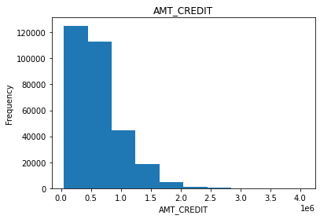
    


     10%|████████▎                                                                          | 1/10 [00:00<00:02,  3.30it/s]


    
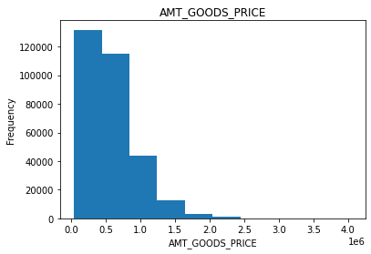
    


     20%|████████████████▌                                                                  | 2/10 [00:00<00:02,  3.52it/s]


    
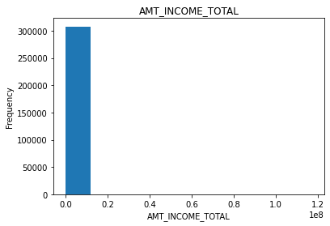
    


     30%|████████████████████████▉                                                          | 3/10 [00:00<00:01,  3.58it/s]


    
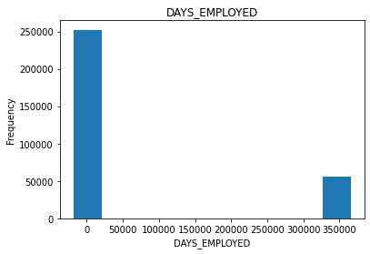
    


     40%|█████████████████████████████████▏                                                 | 4/10 [00:01<00:01,  3.85it/s]


    
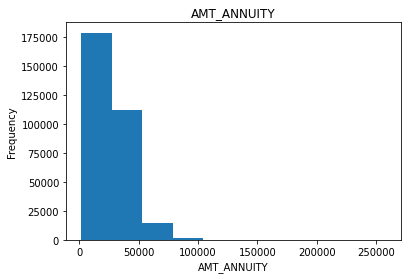
    


     50%|█████████████████████████████████████████▌                                         | 5/10 [00:01<00:01,  4.00it/s]


    
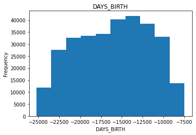
    


     60%|█████████████████████████████████████████████████▊                                 | 6/10 [00:01<00:01,  3.88it/s]


    
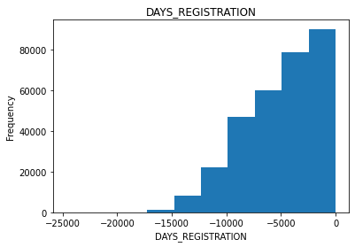
    


     70%|██████████████████████████████████████████████████████████                         | 7/10 [00:01<00:00,  3.60it/s]


    
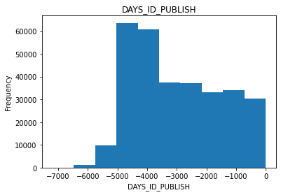
    


     80%|██████████████████████████████████████████████████████████████████▍                | 8/10 [00:02<00:00,  3.51it/s]


    
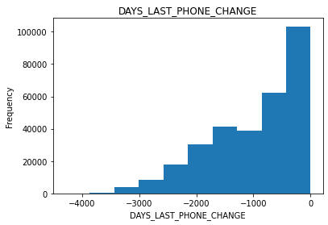
    


     90%|██████████████████████████████████████████████████████████████████████████▋        | 9/10 [00:02<00:00,  3.75it/s]


    
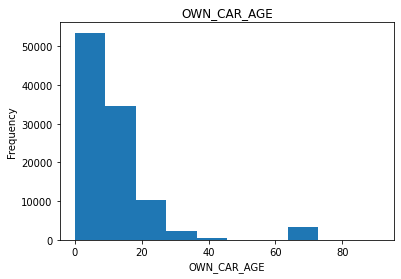
    


    100%|██████████████████████████████████████████████████████████████████████████████████| 10/10 [00:02<00:00,  3.79it/s]
    

Dapat dilihat bahwa data-data berikut memiliki nilai variance yang besar. Terlihat juga bahwa pada plot distribusi data terdapat ketimpangan. Selanjutnya, akan kita cek kolom DAYS_EMPLOYED karena persebarannya yang terlalu besar. Kolom lainnya yang berhubungan dengan mata uang untuk saat ini akan dibiarkan karena tidak diketahui jenis mata uang yang digunakan


```python
(train_df['DAYS_EMPLOYED']).describe()
```


    count    307511.000000
    mean      63815.045904
    std      141275.766519
    min      -17912.000000
    25%       -2760.000000
    50%       -1213.000000
    75%        -289.000000
    max      365243.000000
    Name: DAYS_EMPLOYED, dtype: float64


```python
# Plot a histogram of the 'your_column' data
plt.hist(train_df['DAYS_EMPLOYED'], bins=50, color='blue', edgecolor='black')

# Add labels and title
plt.xlabel('Value')
plt.ylabel('Frequency')
plt.title('Histogram of your_column')

# Show the plot
plt.show()
```


    
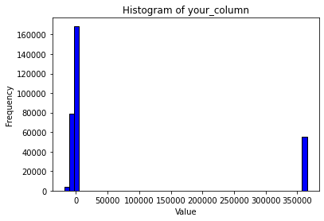
    


Terlihat bahwa persebaran data tersebut tidak masuk akal. Data atau kolom tersebut menunjukan jumlah total hari kerja dari seorang client dan nilai terbesarnya mencapai 365243 hari (setara kurang lebih 1000 tahun). Pada grafik di atas, terlihat bahwa kesalahan tersebut banyak terfokus pada satu nilai yaitu di 365243. Untuk memastikannya, akan dihitung data yang berada di antara nilai 50000 dan 350000.


```python
# Use boolean indexing to filter values within the specified range
filtered_values = train_df['DAYS_EMPLOYED'][(train_df['DAYS_EMPLOYED'] >= 5000) & (train_df['DAYS_EMPLOYED'] <= 350000)]

# Get the count of values within the specified range
len(filtered_values)
```


    0


Terlihat bahwa tidak ada data DAYS_EMPLOYED dengan nilai antara 50000 hingga 350000. Maka, untuk menghilangkan outlier hanya perlu mengganti data dengan nilai 365243 ke NaN atau missing value.


```python
# Replace the anomalous values with nan
train_df["DAYS_EMPLOYED"].replace({365243: np.nan}, inplace = True)

train_df["DAYS_EMPLOYED"].plot.hist(title = 'Days Employment Histogram')
plt.xlabel('Days Employment')
```


    Text(0.5, 0, 'Days Employment')


    
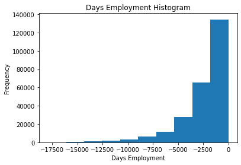
    


Hal yang sama diperlukan juga untuk dilakukan pada dataset testing


```python
(test_df['DAYS_EMPLOYED']).describe()
```


    count     48744.000000
    mean      67485.366322
    std      144348.507136
    min      -17463.000000
    25%       -2910.000000
    50%       -1293.000000
    75%        -296.000000
    max      365243.000000
    Name: DAYS_EMPLOYED, dtype: float64


```python
# Replace the anomalous values with nan
test_df["DAYS_EMPLOYED"].replace({365243: np.nan}, inplace = True)
```

## Correlation


```python
# Find correlations with the target and sort
correlations = train_df.corr()['TARGET'].sort_values()

# Display correlations
print('Most Positive Correlations:\n', correlations.tail(20))
print('\nMost Negative Correlations:\n', correlations.head(20))
```

    Most Positive Correlations:
     DEF_60_CNT_SOCIAL_CIRCLE                             0.031276
    DEF_30_CNT_SOCIAL_CIRCLE                             0.032248
    LIVE_CITY_NOT_WORK_CITY                              0.032518
    OWN_CAR_AGE                                          0.037612
    DAYS_REGISTRATION                                    0.041975
    OCCUPATION_TYPE_Laborers                             0.043019
    FLAG_DOCUMENT_3                                      0.044346
    REG_CITY_NOT_LIVE_CITY                               0.044395
    FLAG_EMP_PHONE                                       0.045982
    NAME_EDUCATION_TYPE_Secondary / secondary special    0.049824
    REG_CITY_NOT_WORK_CITY                               0.050994
    DAYS_ID_PUBLISH                                      0.051457
    CODE_GENDER_M                                        0.054713
    DAYS_LAST_PHONE_CHANGE                               0.055218
    NAME_INCOME_TYPE_Working                             0.057481
    REGION_RATING_CLIENT                                 0.058899
    REGION_RATING_CLIENT_W_CITY                          0.060893
    DAYS_EMPLOYED                                        0.074958
    DAYS_BIRTH                                           0.078239
    TARGET                                               1.000000
    Name: TARGET, dtype: float64
    
    Most Negative Correlations:
     EXT_SOURCE_3                           -0.178919
    EXT_SOURCE_2                           -0.160472
    EXT_SOURCE_1                           -0.155317
    NAME_EDUCATION_TYPE_Higher education   -0.056593
    CODE_GENDER_F                          -0.054704
    NAME_INCOME_TYPE_Pensioner             -0.046209
    ORGANIZATION_TYPE_XNA                  -0.045987
    FLOORSMAX_AVG                          -0.044003
    FLOORSMAX_MEDI                         -0.043768
    FLOORSMAX_MODE                         -0.043226
    EMERGENCYSTATE_MODE_No                 -0.042201
    HOUSETYPE_MODE_block of flats          -0.040594
    AMT_GOODS_PRICE                        -0.039645
    REGION_POPULATION_RELATIVE             -0.037227
    ELEVATORS_AVG                          -0.034199
    ELEVATORS_MEDI                         -0.033863
    FLOORSMIN_AVG                          -0.033614
    FLOORSMIN_MEDI                         -0.033394
    WALLSMATERIAL_MODE_Panel               -0.033119
    LIVINGAREA_AVG                         -0.032997
    Name: TARGET, dtype: float64
    


```python
print('Columns with highest correlations:\n', abs(correlations).sort_values(ascending=False).head(20))
```

    Columns with highest correlations:
     TARGET                                               1.000000
    EXT_SOURCE_3                                         0.178919
    EXT_SOURCE_2                                         0.160472
    EXT_SOURCE_1                                         0.155317
    DAYS_BIRTH                                           0.078239
    DAYS_EMPLOYED                                        0.074958
    REGION_RATING_CLIENT_W_CITY                          0.060893
    REGION_RATING_CLIENT                                 0.058899
    NAME_INCOME_TYPE_Working                             0.057481
    NAME_EDUCATION_TYPE_Higher education                 0.056593
    DAYS_LAST_PHONE_CHANGE                               0.055218
    CODE_GENDER_M                                        0.054713
    CODE_GENDER_F                                        0.054704
    DAYS_ID_PUBLISH                                      0.051457
    REG_CITY_NOT_WORK_CITY                               0.050994
    NAME_EDUCATION_TYPE_Secondary / secondary special    0.049824
    NAME_INCOME_TYPE_Pensioner                           0.046209
    ORGANIZATION_TYPE_XNA                                0.045987
    FLAG_EMP_PHONE                                       0.045982
    REG_CITY_NOT_LIVE_CITY                               0.044395
    Name: TARGET, dtype: float64
    

**Perlu diperhatikan** bahwa beberapa kolom memiliki nilai negatif seperti kolom DAYS_BIRTH. Hal tersebut menandakan bahwa korelasi sebenarnya dari DAYS_BIRTH terbalik atau negatif. Terlihat bahwa secara magnitude, dapat diurutkan kolom dengan korelasi terbesar dengan target yaitu kolom:

1. EXT_SOURCE_3
2. EXT_SOURCE_2
3. EXT_SOURCE_1
4. DAYS_BIRTH
5. DAYS_EMPLOYED
6. REGION_RATING_CLIENT_W_CITY
7. REGION_RATING_CLIENT
8.  NAME_INCOME_TYPE
9.   NAME_EDUCATION_TYPE

Sementara akan digunakan fitur tersebut saja untuk pengembangan modelnya. Beberapa point penting:
1. Seseorang dengan EXT_SOURCE (diasumsikan external source income atau pendapatan ekternal) memiliki kecenderungan yang cukup besar untuk membayar
2. Seseorang yang telah pensiun cenderung untuk membayar, begitu juga dengan usia yang lebih tua
3. Selain itu terdapat point menarik lainnya dimana client wanita lebih cenderung untuk membayar dibandingkan dengan client pria
4. Pendidikan cukup memiliki korelasi yang besar dimana seseorang dengan status  pendidikan Higher education cenderung untuk membayar sedangkan seseorang dengan status pendidikan Secondary / secondary special cenderung untuk sebaliknya
5. 


```python
def draw_categorical_pie(cols):
    # Identify one-hot-encoded columns that start with 'Category'
    one_hot_columns = [col for col in train_df.columns if col.startswith(cols)]

    # Create a new DataFrame containing only the one-hot-encoded columns
    one_hot_df = train_df[one_hot_columns]

    # Calculate the sum of each one-hot-encoded column
    category_counts = one_hot_df.sum()

    # Plot a pie chart
    plt.figure(figsize=(8, 8))
    plt.pie(category_counts, labels=None, autopct='%1.1f%%', startangle=90)
    plt.title('Distribution of One-Hot-Encoded Categories')
    
    # Display labels at the bottom using legend
    plt.legend(category_counts.index, title="Categories", loc="lower center", bbox_to_anchor=(0.5, -0.1), fancybox=True, shadow=True, ncol=len(category_counts))
    
    plt.show()
```

Selanjutnya akan dilakukan pengecekan ulang terhadap kolom-kolom tersebut untuk memastikan bahwa tidak ada outlier atau anomali pada data tersebut


```python
# for later
# col_to_train = ['EXT_SOURCE_3', 'EXT_SOURCE_2', 'EXT_SOURCE_1',
#                 'DAYS_BIRTH', 'DAYS_EMPLOYED',
#                 'REGION_RATING_CLIENT_W_CITY', 'REGION_RATING_CLIENT',
#                 'NAME_INCOME_TYPE_Unemployed', 'NAME_INCOME_TYPE_Working',
#                 'NAME_INCOME_TYPE_Commercial associate', 'NAME_INCOME_TYPE_State servant',
#                 'NAME_INCOME_TYPE_Pensioner', 'NAME_INCOME_TYPE_Businessman', 'NAME_INCOME_TYPE_Student',
#                 'NAME_EDUCATION_TYPE_Lower secondary',
#                 'NAME_EDUCATION_TYPE_Secondary / secondary special',
#                 'NAME_EDUCATION_TYPE_Incomplete higher',
#                 'NAME_EDUCATION_TYPE_Higher education',
#                 'NAME_EDUCATION_TYPE_Academic degree']

# Filter
columns = ['EXT_SOURCE_3', 'EXT_SOURCE_2', 'EXT_SOURCE_1',
            'DAYS_BIRTH', 'DAYS_EMPLOYED',
            'REGION_RATING_CLIENT_W_CITY', 'REGION_RATING_CLIENT',
            'NAME_INCOME_TYPE',
            'NAME_EDUCATION_TYPE']

for cols in tqdm(columns):
    if cols == 'NAME_INCOME_TYPE':
        draw_categorical_pie(cols)
    elif cols == 'NAME_EDUCATION_TYPE':
        draw_categorical_pie(cols)
    else:
        train_df[cols].plot.hist(title = cols)
        plt.xlabel(cols)
        plt.show()
```

      0%|                                                                                            | 0/9 [00:00<?, ?it/s]


    
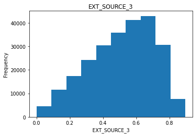
    


     11%|█████████▎                                                                          | 1/9 [00:00<00:01,  4.45it/s]


    
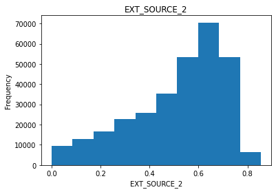
    


     22%|██████████████████▋                                                                 | 2/9 [00:00<00:01,  3.98it/s]


    

    


     33%|████████████████████████████                                                        | 3/9 [00:00<00:01,  4.21it/s]


    

    


     44%|█████████████████████████████████████▎                                              | 4/9 [00:00<00:01,  4.09it/s]


    
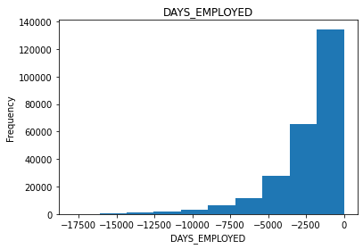
    


     56%|██████████████████████████████████████████████▋                                     | 5/9 [00:01<00:00,  4.08it/s]


    
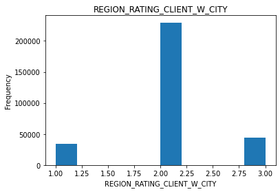
    


     67%|████████████████████████████████████████████████████████                            | 6/9 [00:01<00:00,  4.24it/s]


    
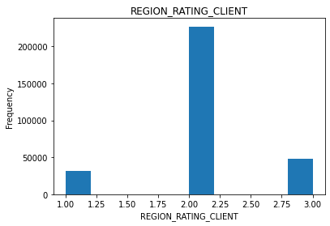
    


     78%|█████████████████████████████████████████████████████████████████▎                  | 7/9 [00:01<00:00,  4.35it/s]


    
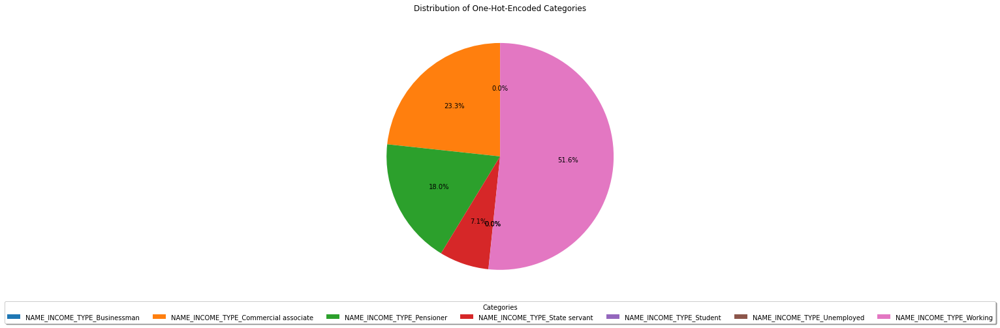
    


     89%|██████████████████████████████████████████████████████████████████████████▋         | 8/9 [00:01<00:00,  4.20it/s]


    
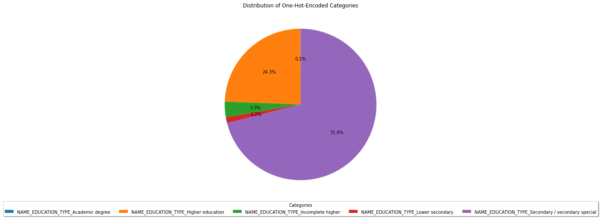
    


    100%|████████████████████████████████████████████████████████████████████████████████████| 9/9 [00:02<00:00,  4.22it/s]
    

Distribusi data terlihat normal. Beberapa point penting seperti:
1. Urutan jumlah client berdasarkan income type: Working, commercial_associate, Pensioner, state_servant, diikuti yang lainnya
3. Urutan jumlah client berdasarkan status pendidikan: Secondary/secondary special, Higher education, Incomplete higher, Lower secondary, dan terakhir Academic degree


```python
numeric_cols = columns = ['EXT_SOURCE_3',
'EXT_SOURCE_2',
'EXT_SOURCE_1',
'DAYS_BIRTH',
'DAYS_EMPLOYED',
'REGION_RATING_CLIENT_W_CITY',
'REGION_RATING_CLIENT']
missing_values = missing_values_table(train_df[numeric_cols])
missing_values
```

    Your selected dataframe has 7 columns.
    There are 4 columns that have missing values.
    


<div>
<style scoped>
    .dataframe tbody tr th:only-of-type {
        vertical-align: middle;
    }

    .dataframe tbody tr th {
        vertical-align: top;
    }

    .dataframe thead th {
        text-align: right;
    }
</style>
<table border="1" class="dataframe">
  <thead>
    <tr style="text-align: right;">
      <th></th>
      <th>Missing Values</th>
      <th>% of Total</th>
    </tr>
  </thead>
  <tbody>
    <tr>
      <th>EXT_SOURCE_1</th>
      <td>173378</td>
      <td>56.4</td>
    </tr>
    <tr>
      <th>EXT_SOURCE_3</th>
      <td>60965</td>
      <td>19.8</td>
    </tr>
    <tr>
      <th>DAYS_EMPLOYED</th>
      <td>55374</td>
      <td>18.0</td>
    </tr>
    <tr>
      <th>EXT_SOURCE_2</th>
      <td>660</td>
      <td>0.2</td>
    </tr>
  </tbody>
</table>
</div>


Kolom EXT_SOURCE_1 memiliki banyak missing values, **ingat untuk menggunakan imputer untuk mengganti missing values dengan median**


```python
def percent_defaulted(cols_prefix):
    # Filter columns that start with the specified prefix
    columns = [col for col in train_df.columns if col.startswith(cols_prefix)]

    category_counts = train_df.groupby('TARGET')[columns].sum()
    category_1_counts = category_counts.loc[1]
    category_0_counts = category_counts.loc[0]

    percentage_df = (100 * category_1_counts/(category_0_counts+category_1_counts)).sort_values(ascending=False)
    print(f'Percentage of defaulted client per {cols_prefix}:')
    print(percentage_df)
    print(f'Percentage of non-defaulted client per {cols_prefix}:')
    print(100-percentage_df)
```


```python
percent_defaulted('NAME_INCOME_TYPE')
```

    Percentage of defaulted client per NAME_INCOME_TYPE:
    NAME_INCOME_TYPE_Unemployed              36.363636
    NAME_INCOME_TYPE_Working                  9.588472
    NAME_INCOME_TYPE_Commercial associate     7.484257
    NAME_INCOME_TYPE_State servant            5.754965
    NAME_INCOME_TYPE_Pensioner                5.386366
    NAME_INCOME_TYPE_Businessman              0.000000
    NAME_INCOME_TYPE_Student                  0.000000
    dtype: float64
    Percentage of non-defaulted client per NAME_INCOME_TYPE:
    NAME_INCOME_TYPE_Unemployed               63.636364
    NAME_INCOME_TYPE_Working                  90.411528
    NAME_INCOME_TYPE_Commercial associate     92.515743
    NAME_INCOME_TYPE_State servant            94.245035
    NAME_INCOME_TYPE_Pensioner                94.613634
    NAME_INCOME_TYPE_Businessman             100.000000
    NAME_INCOME_TYPE_Student                 100.000000
    dtype: float64
    

Poin menarik:
1. Seluruh bussinessman dan seluruh student membayar, tapi jumlah client tersebut sedikit **belum pasti jika client jenis ini lebih ramai semuanya akan membayar juga, tetapi ada baiknya dilakukan campaign dan juga taktik khusus seperti pinjaman pendidikan dengan metode bayar yang berbeda atau pinjaman bisnis dengan metode pembayaran berupa royalti  atau semacamnya (gaya sharktank)** 
2. Client unemployed paling sulit membayar, jumlah client pun sedikit **Perlu ada taktik seperti planning supaya client jenis ini lebih sering membayar**
3. Pensioner cenderung untuk membayar dan jumlah client tersebut juga banyak (18% dari total), **ada baiknya dilakukan campaign lebih terhadap tipe ini supaya lebih ramai pensiunan yang menggunakan jasa home credit**
4. Sisanya biasa saja dan hanya perlu ditingkatkan untuk state servant dan commercial associate, sementara working class client bisa digunakan taktik yang lebih umum


```python
percent_defaulted('NAME_EDUCATION_TYPE')
```

    Percentage of defaulted client per NAME_EDUCATION_TYPE:
    NAME_EDUCATION_TYPE_Lower secondary                  10.927673
    NAME_EDUCATION_TYPE_Secondary / secondary special     8.939929
    NAME_EDUCATION_TYPE_Incomplete higher                 8.484966
    NAME_EDUCATION_TYPE_Higher education                  5.355115
    NAME_EDUCATION_TYPE_Academic degree                   1.829268
    dtype: float64
    Percentage of non-defaulted client per NAME_EDUCATION_TYPE:
    NAME_EDUCATION_TYPE_Lower secondary                  89.072327
    NAME_EDUCATION_TYPE_Secondary / secondary special    91.060071
    NAME_EDUCATION_TYPE_Incomplete higher                91.515034
    NAME_EDUCATION_TYPE_Higher education                 94.644885
    NAME_EDUCATION_TYPE_Academic degree                  98.170732
    dtype: float64
    

Poin menarik:
1. client dengan status pendidikan lower secondary (SMP/Sederajat) cenderung sulit untuk membayar dan jumlahnya pun sedikit, **lebih baik dihindari dan perlu plan yang lebih cocok**
2. Semakin tinggi derajat pendidikan client semakin sering membayar, yang cukup menarik adalah client dengan higher education berjumlah cukup banyak (terbanyak kedua) dan lebih sering membayar (posisi kedua terakhir pada list kesulitan membayar), sehingga **perlu ada upaya lebih untuk menarik pelanggan dengan status pendidikan higher education**

## Model Training and Evaluation
Selanjutnya adalah training model dan evaluasinya. Untuk model awal akan digunakan model Logistic Regression


```python
from sklearn.preprocessing import MinMaxScaler
from sklearn.impute import SimpleImputer
```


```python
from sklearn.model_selection import train_test_split
from sklearn.metrics import confusion_matrix, roc_auc_score, roc_curve

if 'TARGET' in app_train:
    train = app_train.drop(columns = ['TARGET'])
else:
    train = app_train.copy()]

# Feature names
features = list(train.columns)

# Median imputation of missing values
imputer = SimpleImputer(missing_values=np.nan, strategy='median')

# Scale each feature to 0-1
scaler = MinMaxScaler(feature_range = (0, 1))

# Fit on the training data
imputer.fit(train)

# Transform both training and testing data
train = imputer.transform(train)

# Repeat with the scaler
scaler.fit(train)
train = scaler.transform(train)

print('Training data shape: ', train.shape)
```

    Training data shape:  (307511, 19)
    


```python
label_column = 'TARGET'

# Split the data into training and validation sets
X_train, X_valid, y_train, y_valid = train_test_split(train, train_label, test_size=0.2, random_state=42)
```


```python
from sklearn.linear_model import LogisticRegression

# Make the model with the specified regularization parameter
log_reg = LogisticRegression(C = 0.0001)

# Train on the training data
log_reg.fit(X_train, y_train)
```


<style>#sk-container-id-2 {color: black;}#sk-container-id-2 pre{padding: 0;}#sk-container-id-2 div.sk-toggleable {background-color: white;}#sk-container-id-2 label.sk-toggleable__label {cursor: pointer;display: block;width: 100%;margin-bottom: 0;padding: 0.3em;box-sizing: border-box;text-align: center;}#sk-container-id-2 label.sk-toggleable__label-arrow:before {content: "▸";float: left;margin-right: 0.25em;color: #696969;}#sk-container-id-2 label.sk-toggleable__label-arrow:hover:before {color: black;}#sk-container-id-2 div.sk-estimator:hover label.sk-toggleable__label-arrow:before {color: black;}#sk-container-id-2 div.sk-toggleable__content {max-height: 0;max-width: 0;overflow: hidden;text-align: left;background-color: #f0f8ff;}#sk-container-id-2 div.sk-toggleable__content pre {margin: 0.2em;color: black;border-radius: 0.25em;background-color: #f0f8ff;}#sk-container-id-2 input.sk-toggleable__control:checked~div.sk-toggleable__content {max-height: 200px;max-width: 100%;overflow: auto;}#sk-container-id-2 input.sk-toggleable__control:checked~label.sk-toggleable__label-arrow:before {content: "▾";}#sk-container-id-2 div.sk-estimator input.sk-toggleable__control:checked~label.sk-toggleable__label {background-color: #d4ebff;}#sk-container-id-2 div.sk-label input.sk-toggleable__control:checked~label.sk-toggleable__label {background-color: #d4ebff;}#sk-container-id-2 input.sk-hidden--visually {border: 0;clip: rect(1px 1px 1px 1px);clip: rect(1px, 1px, 1px, 1px);height: 1px;margin: -1px;overflow: hidden;padding: 0;position: absolute;width: 1px;}#sk-container-id-2 div.sk-estimator {font-family: monospace;background-color: #f0f8ff;border: 1px dotted black;border-radius: 0.25em;box-sizing: border-box;margin-bottom: 0.5em;}#sk-container-id-2 div.sk-estimator:hover {background-color: #d4ebff;}#sk-container-id-2 div.sk-parallel-item::after {content: "";width: 100%;border-bottom: 1px solid gray;flex-grow: 1;}#sk-container-id-2 div.sk-label:hover label.sk-toggleable__label {background-color: #d4ebff;}#sk-container-id-2 div.sk-serial::before {content: "";position: absolute;border-left: 1px solid gray;box-sizing: border-box;top: 0;bottom: 0;left: 50%;z-index: 0;}#sk-container-id-2 div.sk-serial {display: flex;flex-direction: column;align-items: center;background-color: white;padding-right: 0.2em;padding-left: 0.2em;position: relative;}#sk-container-id-2 div.sk-item {position: relative;z-index: 1;}#sk-container-id-2 div.sk-parallel {display: flex;align-items: stretch;justify-content: center;background-color: white;position: relative;}#sk-container-id-2 div.sk-item::before, #sk-container-id-2 div.sk-parallel-item::before {content: "";position: absolute;border-left: 1px solid gray;box-sizing: border-box;top: 0;bottom: 0;left: 50%;z-index: -1;}#sk-container-id-2 div.sk-parallel-item {display: flex;flex-direction: column;z-index: 1;position: relative;background-color: white;}#sk-container-id-2 div.sk-parallel-item:first-child::after {align-self: flex-end;width: 50%;}#sk-container-id-2 div.sk-parallel-item:last-child::after {align-self: flex-start;width: 50%;}#sk-container-id-2 div.sk-parallel-item:only-child::after {width: 0;}#sk-container-id-2 div.sk-dashed-wrapped {border: 1px dashed gray;margin: 0 0.4em 0.5em 0.4em;box-sizing: border-box;padding-bottom: 0.4em;background-color: white;}#sk-container-id-2 div.sk-label label {font-family: monospace;font-weight: bold;display: inline-block;line-height: 1.2em;}#sk-container-id-2 div.sk-label-container {text-align: center;}#sk-container-id-2 div.sk-container {/* jupyter's `normalize.less` sets `[hidden] { display: none; }` but bootstrap.min.css set `[hidden] { display: none !important; }` so we also need the `!important` here to be able to override the default hidden behavior on the sphinx rendered scikit-learn.org. See: https://github.com/scikit-learn/scikit-learn/issues/21755 */display: inline-block !important;position: relative;}#sk-container-id-2 div.sk-text-repr-fallback {display: none;}</style><div id="sk-container-id-2" class="sk-top-container"><div class="sk-text-repr-fallback"><pre>LogisticRegression(C=0.0001)</pre><b>In a Jupyter environment, please rerun this cell to show the HTML representation or trust the notebook. <br />On GitHub, the HTML representation is unable to render, please try loading this page with nbviewer.org.</b></div><div class="sk-container" hidden><div class="sk-item"><div class="sk-estimator sk-toggleable"><input class="sk-toggleable__control sk-hidden--visually" id="sk-estimator-id-2" type="checkbox" checked><label for="sk-estimator-id-2" class="sk-toggleable__label sk-toggleable__label-arrow">LogisticRegression</label><div class="sk-toggleable__content"><pre>LogisticRegression(C=0.0001)</pre></div></div></div></div></div>


```python
# Copy of the testing data
test = test_df.copy()
test = test[features]
test = imputer.transform(test)
test = scaler.transform(test)
print('Testing data shape: ', test.shape)

# Make predictions
# Make sure to select the second column only
log_reg_pred = log_reg.predict_proba(test)[:, 1]
```

    Testing data shape:  (48744, 19)
    


```python
# Make predictions on the validation set
y_pred_valid = log_reg.predict(X_valid)

# Evaluate using confusion matrix
conf_matrix = confusion_matrix(y_valid, y_pred_valid)
print("Confusion Matrix:")
print(conf_matrix)

# Calculate ROC AUC score
roc_auc = roc_auc_score(y_valid, y_pred_valid)
print(f"ROC AUC Score: {roc_auc:.2f}")

# Plot ROC curve
fpr, tpr, _ = roc_curve(y_valid, y_pred_valid)
plt.plot(fpr, tpr, color='darkorange', lw=2, label='ROC curve')
plt.plot([0, 1], [0, 1], color='navy', lw=2, linestyle='--')
plt.xlabel('False Positive Rate')
plt.ylabel('True Positive Rate')
plt.title('ROC Curve')
plt.legend(loc='lower right')
plt.show()
```

    Confusion Matrix:
    [[56554     0]
     [ 4949     0]]
    ROC AUC Score: 0.50
    


    
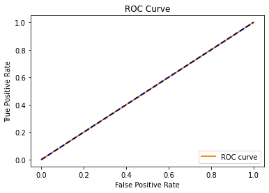
    


```python
# Submission dataframe
submit = test_df[['SK_ID_CURR']]
submit['TARGET'] = log_reg_pred

# Apply threshold
threshold = 0.5
che = (submit['TARGET'] > threshold).astype(int)
count_of_ones = np.sum(y_pred_valid == 1)

submit['TARGET'].dtype
print(count_of_ones)
```

    0
    

## Feature Engineering
### Domain knowledge engineering
Terdapat beberapa poin penting yang diperlukan untuk menentukan bahwa seseorang akan mengalami kesulitan membayar atau tidak dalam ranah peminjaman. Beberapa contohnya adalah:
1. 

### Polynomial features


```python
features = ['EXT_SOURCE_3', 'EXT_SOURCE_2', 'EXT_SOURCE_1',
                'DAYS_BIRTH', 'DAYS_EMPLOYED',
                'REGION_RATING_CLIENT_W_CITY', 'REGION_RATING_CLIENT',
                'NAME_INCOME_TYPE_Unemployed', 'NAME_INCOME_TYPE_Working',
                'NAME_INCOME_TYPE_Commercial associate', 'NAME_INCOME_TYPE_State servant',
                'NAME_INCOME_TYPE_Pensioner', 'NAME_INCOME_TYPE_Businessman', 'NAME_INCOME_TYPE_Student',
                'NAME_EDUCATION_TYPE_Lower secondary',
                'NAME_EDUCATION_TYPE_Secondary / secondary special',
                'NAME_EDUCATION_TYPE_Incomplete higher',
                'NAME_EDUCATION_TYPE_Higher education',
                'NAME_EDUCATION_TYPE_Academic degree']
```


```python

```
